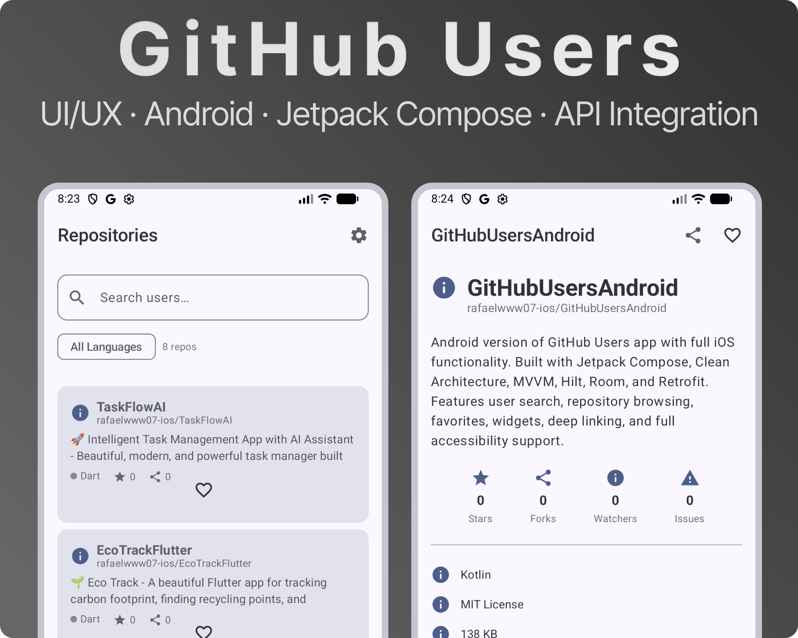

# GitHub Users - Android App

<div align="center">


Android версия приложения GitHub Users с полным функционалом из iOS версии.

[Features](#-features) • [Architecture](#-architecture) • [Tech Stack](#-tech-stack) • [Setup](#-setup) • [License](#-license)

</div>

## ✨ Features

### Основной функционал
- ✅ **Поиск пользователей** - Поиск пользователей GitHub с debouncing (500ms) и пагинацией
- ✅ **Профили пользователей** - Детальная информация о пользователе со статистикой и графиками
- ✅ **Репозитории пользователя** - Просмотр репозиториев с сортировкой, фильтрацией и поиском
- ✅ **Детали репозитория** - Полная информация о репозитории
- ✅ **Глобальный поиск репозиториев** - Поиск по всем репозиториям GitHub
- ✅ **Избранное пользователей** - Сохранение и просмотр избранных пользователей
- ✅ **Избранное репозиториев** - Сохранение и просмотр избранных репозиториев
- ✅ **История поиска** - Быстрый доступ к недавним поискам (до 20 записей)

### Технические функции
- ✅ **Офлайн поддержка** - Двухуровневое кэширование (память + диск) через Room
- ✅ **Интернационализация** - Полная поддержка английского и русского языков
- ✅ **Тема** - Поддержка светлой, тёмной и системной темы
- ✅ **Splash Screen** - Современный splash screen с использованием Splash Screen API
- ✅ **Widgets** - Android App Widget для отображения избранных пользователей
- ✅ **Deep Linking** - Поддержка custom scheme (`githubusers://`) и Universal Links
- ✅ **Accessibility** - Полная поддержка TalkBack, contentDescription, semantics, Dynamic Type
- ✅ **Haptic Feedback** - Тактильная обратная связь для пользовательских действий
- ✅ **Image Caching** - Кэширование изображений через Coil
- ✅ **Network Monitoring** - Индикатор состояния сети в реальном времени
- ✅ **Charts** - Графики статистики пользователя с использованием Vico
- ✅ **Performance Monitoring** - Мониторинг производительности операций

## 🏗️ Architecture

Приложение следует принципам **Clean Architecture** с паттерном **MVVM** для слоя представления.

### Структура проекта

```
app/src/main/java/com/rafaelmukhametov/githubusersandroid/
├── data/
│   ├── local/              # Room база данных, DAO, Entity
│   ├── model/              # Модели данных (DTO)
│   ├── remote/             # Retrofit API интерфейсы
│   └── repository/         # Реализации репозиториев и сервисов
├── domain/
│   └── repository/         # Интерфейсы репозиториев и сервисов
├── di/                     # Hilt модули для Dependency Injection
├── ui/
│   ├── component/          # Переиспользуемые UI компоненты
│   ├── screen/             # Экраны приложения (Compose)
│   ├── theme/              # Тема и стили
│   └── viewmodel/          # ViewModels
├── util/                   # Утилиты (DeepLinkManager, ThemeManager, etc.)
├── widget/                 # Android App Widget
└── GitHubUsersApplication.kt
```

### Слои архитектуры

1. **Domain Layer** - Модели и бизнес-логика (интерфейсы репозиториев)
2. **Data Layer** - Сервисы, репозитории и источники данных (Room, Retrofit)
3. **Presentation Layer** - ViewModels и UI (Jetpack Compose)

## 🛠️ Tech Stack

- **Jetpack Compose** - Современный декларативный UI фреймворк
- **Kotlin Coroutines** - Асинхронные операции
- **Flow** - Реактивное программирование
- **MVVM** - Паттерн представления
- **Clean Architecture** - Многослойная архитектура
- **Hilt** - Dependency Injection
- **Room** - Локальная база данных
- **Retrofit** - HTTP клиент для GitHub API
- **Coil** - Загрузка и кэширование изображений
- **Navigation Compose** - Навигация между экранами
- **DataStore** - Хранение настроек (тема, язык)
- **Vico** - Библиотека для создания графиков
- **Splash Screen API** - Современный splash screen

## 📋 Requirements

- **Android**: 7.0+ (API 24+)
- **Kotlin**: 1.9.22
- **Gradle**: 8.13.2
- **Android Studio**: Hedgehog | 2023.1.1+

## 🚀 Setup

1. **Клонируйте репозиторий:**
```bash
git clone https://github.com/rafaelmukhametov/GitHubUsersAndroid.git
cd GitHubUsersAndroid
```

2. **Откройте проект в Android Studio**

3. **Синхронизируйте Gradle зависимости** (Android Studio сделает это автоматически)

4. **Запустите приложение** (⌃R / ⌘R)

## 📦 Dependencies

Основные зависимости управляются через `gradle/libs.versions.toml`:

- **Jetpack Compose BOM** (2024.09.00)
- **Hilt** (2.51.1) для DI
- **Room** (2.6.1) для локальной БД
- **Retrofit** (2.11.0) для сетевых запросов
- **Coil** (2.7.0) для загрузки изображений
- **Navigation Compose** (2.8.4)
- **DataStore** (1.1.1) для настроек
- **Vico** (1.14.0) для графиков
- **Splash Screen** (1.0.1)

## 🎨 Screenshots

<div align="center">



</div>

Приложение включает следующие экраны:

- **Список пользователей** - Поиск и просмотр пользователей GitHub
- **Детали пользователя** - Профиль со статистикой и графиками
- **Репозитории пользователя** - Список репозиториев с фильтрацией
- **Детали репозитория** - Полная информация о репозитории
- **Поиск репозиториев** - Глобальный поиск по всем репозиториям
- **Избранное** - Избранные пользователи и репозитории
- **Настройки** - Управление темой и языком

## 🔗 Deep Linking

Приложение поддерживает deep linking:

- **Custom Scheme**: `githubusers://user/{username}`
- **Custom Scheme**: `githubusers://repo/{owner}/{repo}`
- **Universal Links**: `https://github.com/{username}`
- **Universal Links**: `https://github.com/{owner}/{repo}`

## 🧪 Testing

Проект готов к добавлению тестов:

- Unit тесты для ViewModels
- Unit тесты для репозиториев
- UI тесты для экранов (Compose Testing)

## 📝 Development Status

### ✅ Полностью реализовано

- ✅ Поиск пользователей с debouncing и пагинацией
- ✅ Детальные профили пользователей со статистикой
- ✅ Список и детали репозиториев
- ✅ Глобальный поиск репозиториев
- ✅ Избранное (пользователи и репозитории)
- ✅ История поиска
- ✅ Локализация (EN/RU)
- ✅ Управление темой (Light/Dark/System)
- ✅ Deep linking
- ✅ Widgets
- ✅ Accessibility
- ✅ Haptic feedback
- ✅ Performance monitoring
- ✅ Network monitoring
- ✅ Charts для статистики

**Реализовано: 100% функционала iOS версии** 🎉

## 📄 License

This project is licensed under the MIT License - see the [LICENSE](LICENSE) file for details.

## 👤 Author

**Rafael Mukhametov**

- GitHub: [@rafaelmukhametov](https://github.com/rafaelmukhametov)

## 🙏 Acknowledgments

- GitHub API для предоставления данных
- iOS версия приложения как референс для функционала
- Jetpack Compose team за отличный UI фреймворк

---

<div align="center">

Создано с ❤️ используя Jetpack Compose и современные практики разработки Android.

[⬆ Back to Top](#github-users---android-app)

</div>
